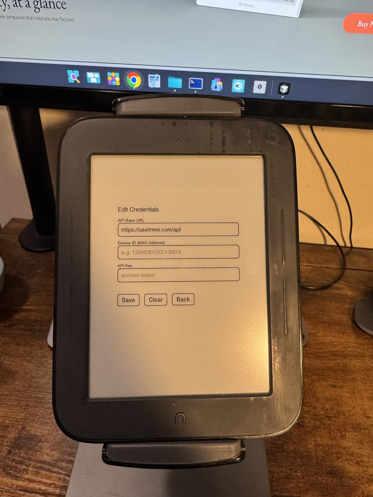
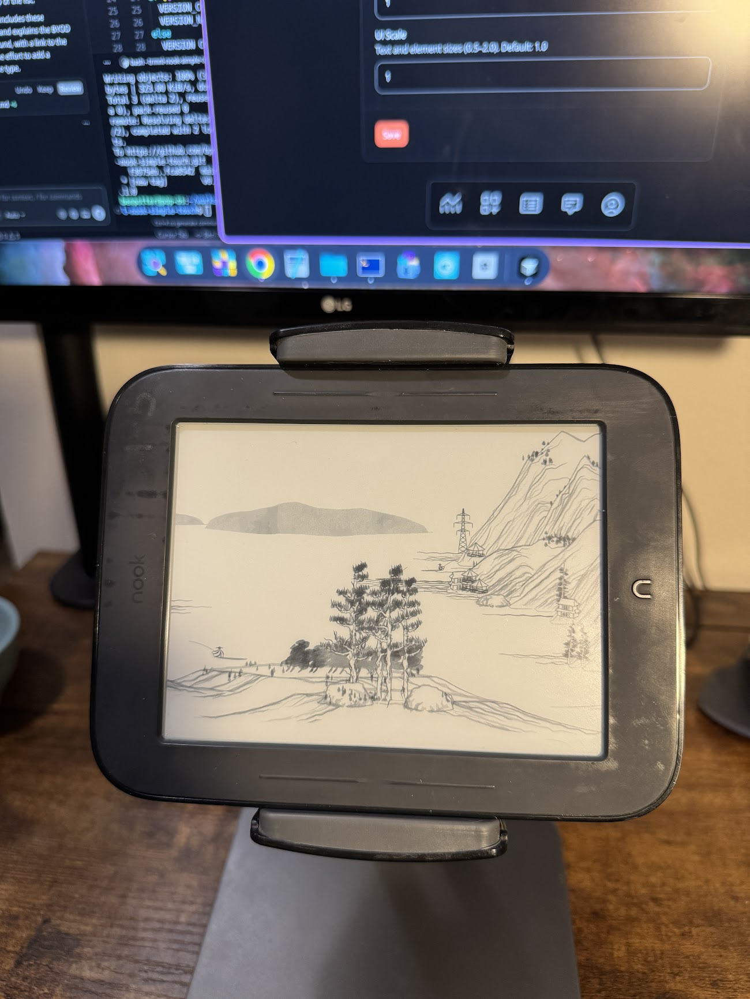
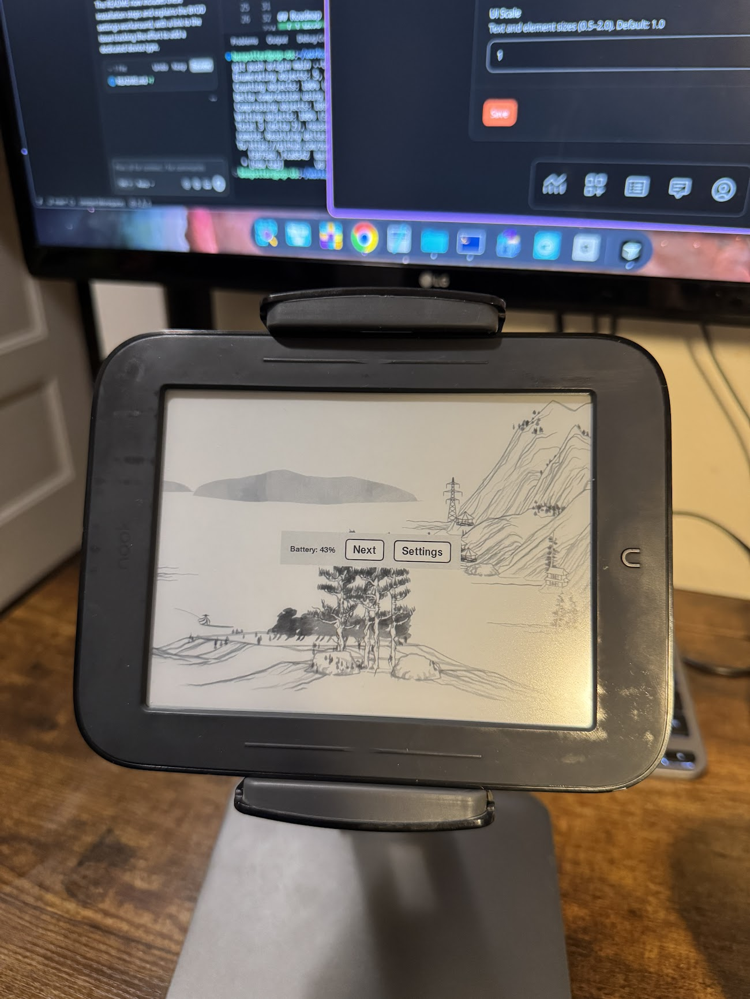

# TRMNL client for Nook Simple Touch

This is a TRMNL client for the Nook Simple Touch (BNRV300). The device usually goes for around $30 on eBay and has an 800x600 e-ink display.

<table>
<tr>
<td width="33%"> <em>Configuration screen</em></td>
<td width="33%"> <em>Fullscreen view of the display</em></td>
<td width="33%"> <em>Menu dialog</em></td>
</tr>
</table>

Questions or feedback? Please [open an issue](https://github.com/bpmct/trmnl-nook-simple-touch/issues/new).

## Prerequisites
- Root the device using the [Phoenix Project](https://xdaforums.com/t/nst-g-the-phoenix-project.4673934/). I used "phase 4" (the minimal rooted install for customization). The phases were confusing because you do not need phase 1/2/3 (each is a separate backup).
- Buy a [TRMNL BYOD license](https://shop.usetrmnl.com/collections/frontpage/products/byod) and grab your SSID + API key from Developer Settings after login (or use your own server).

## Install
- Download the APK from [GitHub Releases](https://github.com/bpmct/trmnl-nook-simple-touch/releases).
- Connect the Nook Simple Touch over USB and copy the APK over.
- Open the included "ES File Explorer" app.
- `In ES File Explorer: Favorites -> "/" -> "media" -> "My Files".`
- Tap the APK and install.
- Connect your device to WiFi
- Open the app and configure the device info

## Device Settings

In the TRMNL Device settings, set the device type to "Amazon Kindle 7" (800x600). This matches the Nook Simple Touch's display resolution. See [issue #10](https://github.com/bpmct/trmnl-nook-simple-touch/issues/10) for why this workaround is needed and efforts to add a dedicated device type.

## What this client does
- On-device config UI for device ID, API key, and API URL (BYOS)
- Fetches your screen and shows it full screen on the Nook, bypassing the lock screen until you exit
- Properly respects playlist intervals to advance to the next screen
- TLS v1.2 via BouncyCastle (not included in Android 2.1)
- BYOD support for TRMNL and custom server URLs
- Reports battery voltage and Wi-Fi signal strength

## Roadmap
- [ ] Document battery life expectations on new and old devices (https://github.com/bpmct/trmnl-nook-simple-touch/issues/9)
- [ ] Rubber cleaning and mounting options (https://github.com/bpmct/trmnl-nook-simple-touch/issues/11)
- [ ] Use device deep sleep to save battery (https://github.com/bpmct/trmnl-nook-simple-touch/issues/7)
- [ ] Test on the Glowlight BNRV350 (https://github.com/bpmct/trmnl-nook-simple-touch/issues/6)

## Development
See the CI workflow for build details ([`build-apk.yml`](https://github.com/bpmct/trmnl-nook-simple-touch/blob/main/.github/workflows/build-apk.yml)), and the `tools/` adb scripts for build/install workflows. A development guide is coming (https://github.com/bpmct/trmnl-nook-simple-touch/issues/8). In the meantime, the project can be built with surprisingly minimal, self-contained dependencies.

## Disclaimer
AI was used to help code this repo. I have a software development background, but did not want to relearn old Java and the Android 2.1 ecosystem. Despite best-effort scanning and review, the device and/or this software may contain vulnerabilities. Use at your own risk, and if you want to be safer, run it on a guest network.
